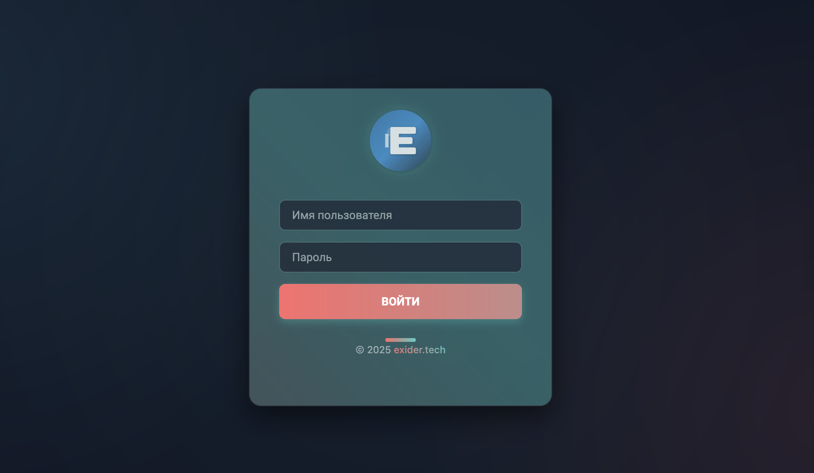
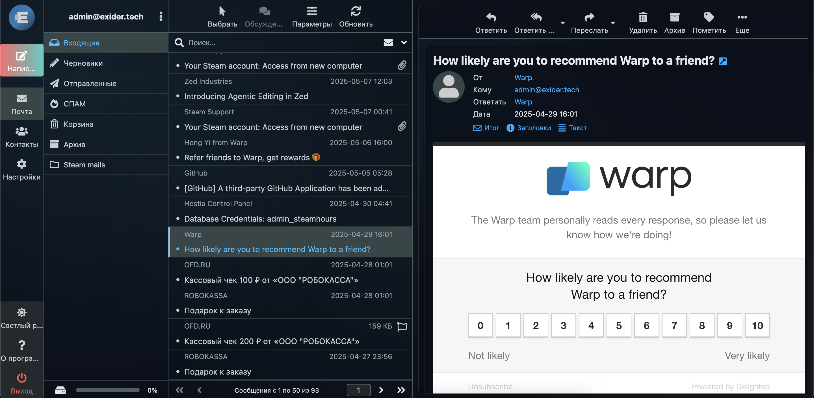

# RC-Fade-Theme

<div align="center">
  
  <br/>
  
</div>

[English](#english) | [Русский](#русский)

---

## English

### 🌟 Overview
RC-Fade-Theme is a modern, elegant theme for Roundcube webmail client. Based on the default Elastic skin, it introduces a fresh look with smooth gradients, elegant blur effects, and improved visual hierarchy.

### ✨ Features
- Modern gradient-based design
- Smooth animations and transitions
- Enhanced visual feedback
- Improved dark mode support
- Optimized mobile interface
- Blur effects for depth

### 🔄 Modified Components
The theme modifies the following core components of the Elastic skin:

```
skins/elastic/
├── templates/
│   ├── includes/
│   │   ├── layout.html       # Enhanced layout structure
│   │   └── global-styles.html # New styling system
│   └── login.html           # Redesigned login page
```

### 🛠️ Installation
1. Copy the theme directory to `/var/lib/roundcube/skins`:
   ```bash
   cp -r rcfadetheme /var/lib/roundcube/skins/
   ```
2. Navigate to `/etc/roundcube`:
   ```bash
   cd /etc/roundcube
   ```
3. Edit `defaults.inc.php` and set the skin parameter:
   ```php
   $config['skin'] = 'rcfadetheme';
   ```
4. Refresh your webmail page

### 🎨 Key Style Changes
- Implemented gradient-based color scheme
- Added backdrop-filter effects
- Enhanced button and input styles
- Improved spacing and typography
- Optimized dark mode contrast

---

## Русский

### 🌟 Обзор
RC-Fade-Theme - это современная, элегантная тема для почтового клиента Roundcube. Основанная на стандартной теме Elastic, она привносит свежий взгляд с плавными градиентами, элегантными эффектами размытия и улучшенной визуальной иерархией.

### ✨ Особенности
- Современный дизайн на основе градиентов
- Плавные анимации и переходы
- Улучшенная визуальная отзывчивость
- Расширенная поддержка темного режима
- Оптимизированный мобильный интерфейс
- Эффекты размытия для глубины

### 🔄 Измененные Компоненты
Тема модифицирует следующие основные компоненты скина Elastic:

```
skins/elastic/
├── templates/
│   ├── includes/
│   │   ├── layout.html       # Улучшенная структура макета
│   │   └── global-styles.html # Новая система стилей
│   └── login.html           # Обновленная страница входа
```

### 🛠️ Установка
1. Скопируйте каталог темы в `/var/lib/roundcube/skins`:
   ```bash
   cp -r rcfadetheme /var/lib/roundcube/skins/
   ```
2. Перейдите в `/etc/roundcube`:
   ```bash
   cd /etc/roundcube
   ```
3. Отредактируйте `defaults.inc.php` и измените параметр скина:
   ```php
   $config['skin'] = 'rcfadetheme';
   ```
4. Обновите страницу веб-почты

### 🎨 Ключевые Изменения в Стилях
- Внедрена цветовая схема на основе градиентов
- Добавлены эффекты backdrop-filter
- Улучшены стили кнопок и полей ввода
- Оптимизированы отступы и типографика
- Улучшен контраст в темном режиме

---

<div align="center">
  Made with ❤️ by <a href="https://github.com/Ex1d3r">Ex1d3r</a>
</div>
